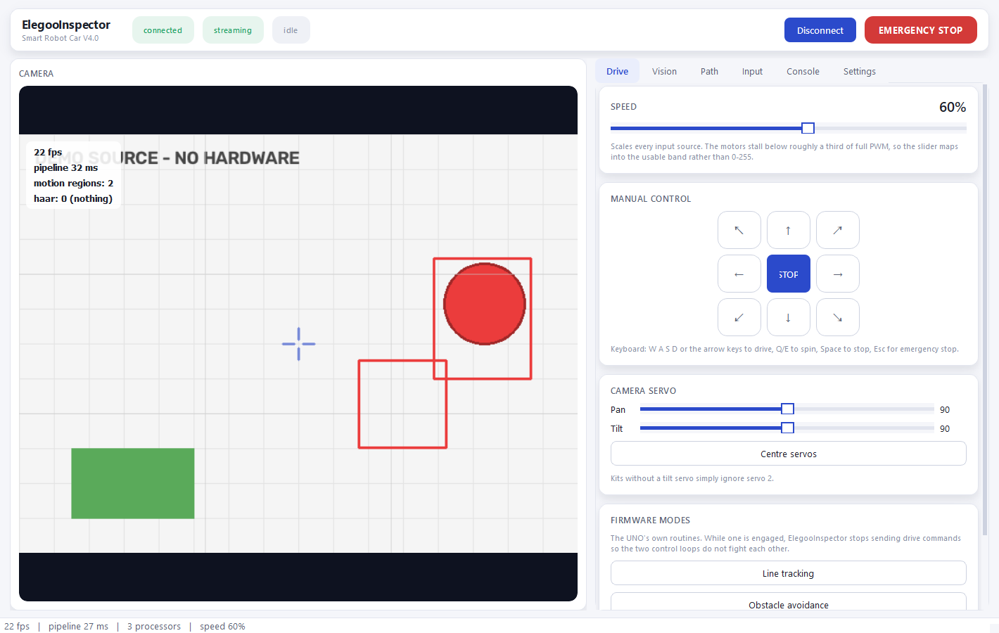
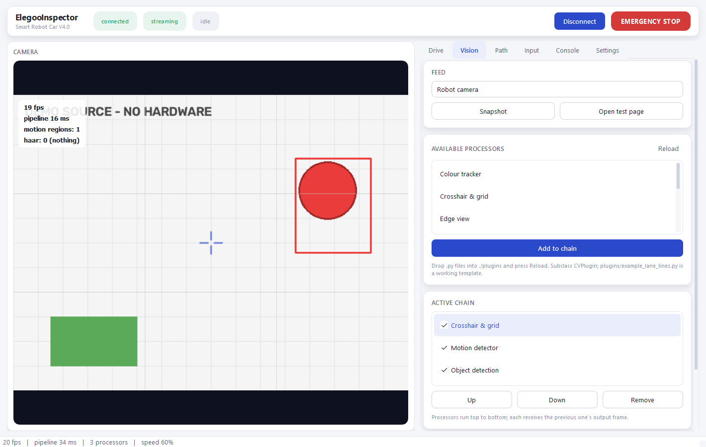
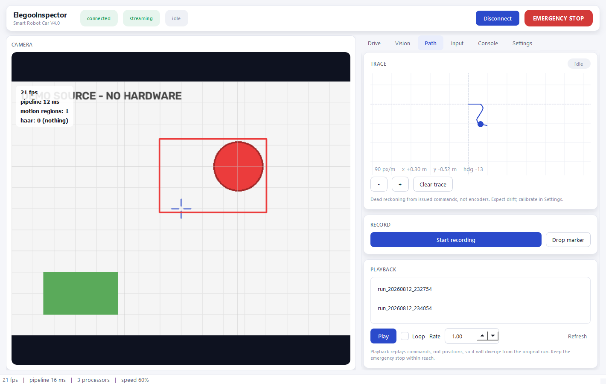
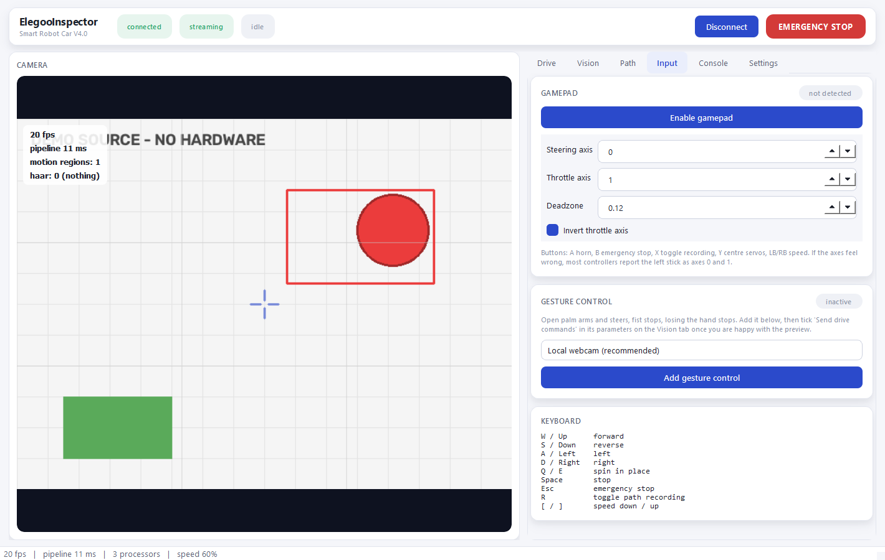
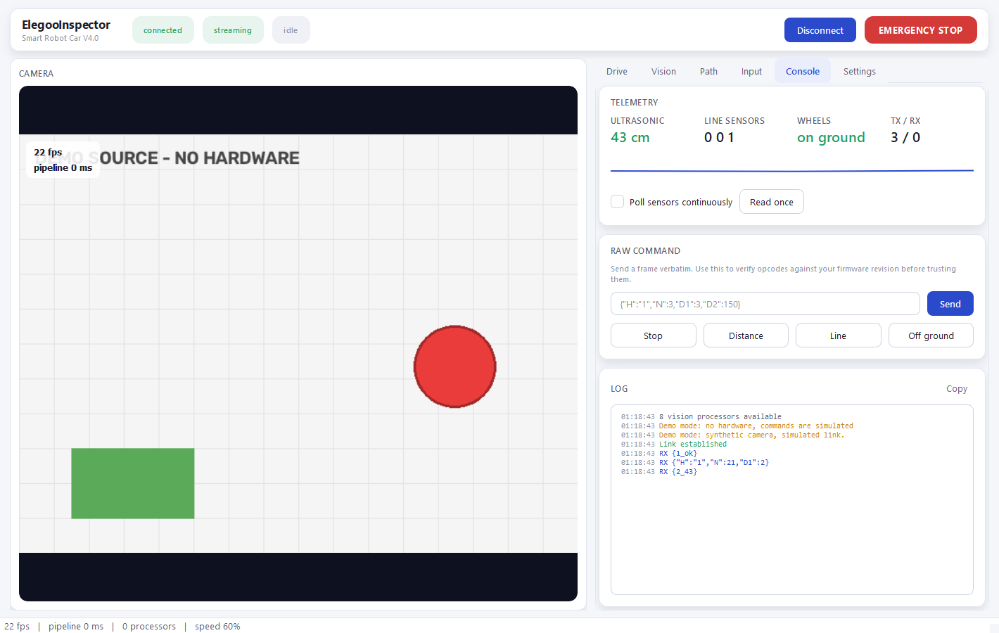
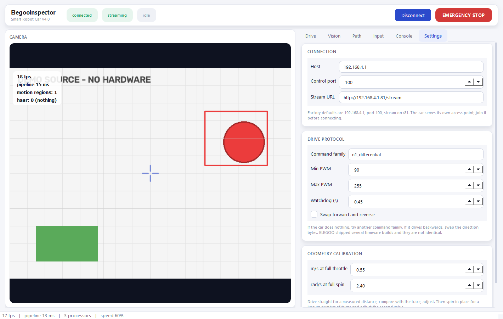

# ElegooInspector

A Windows desktop controller for the **ELEGOO Smart Robot Car V4.0 (camera
edition)** that talks to the kit exactly as it ships. No firmware flashing,
no wiring changes, no Arduino IDE.

Live low-latency camera feed, a pluggable computer-vision pipeline, gamepad /
keyboard / finger-pose control, path recording and playback, and a raw
console for poking at the protocol directly.

<p>
  
  
  
  
  
  
</p>



---

## Contents

- [Features](#features)
- [Screenshots](#screenshots)
- [Requirements](#requirements)
- [Installation](#installation)
- [Running it](#running-it)
- [How it talks to the car](#how-it-talks-to-the-car)
- [Plugins](#plugins)
- [Configuration](#configuration)
- [Troubleshooting](#troubleshooting)
- [Honest limitations](#honest-limitations)
- [Roadmap](#roadmap)
- [Contributing](#contributing)
- [License](#license)

---

## Features

**Camera** — MJPEG parsed off a raw socket with a latest-frame-wins policy.
`cv2.VideoCapture` buffers, which means steering from a stale picture; this
doesn't, including under load — if decoding falls behind, the reader skips
straight to the newest complete frame instead of working through a backlog.
Switch between the robot camera, a local webcam, a video file, or off
entirely, from the Vision tab's Feed selector.

**Vision plugins** — processors run as an ordered chain, each receiving the
previous one's output frame. Built in: crosshair overlay, edge view, motion
detection, HSV colour tracking, object detection, video writer. See
[Plugins](#plugins) below.

Object detection tries `ultralytics` (YOLOv8), then OpenCV DNN with
MobileNet-SSD from `./models`, then Haar cascades, falling through to the
next automatically if one fails. Whatever you have installed is what it
uses; the panel tells you which. `ultralytics` fetches its weights from the
internet the first time it runs — do that once before joining the car's own
WiFi, which has none, or it falls back to the next backend for that session.

**Gamepad** — pygame, with hot-plug handling: unplug mid-drive and the car
stops rather than continuing on the last stick reading. Axes and buttons are
remappable in the Input panel, and the button hint there switches between
Xbox-style (A/B/X/Y) and PlayStation-style (Cross/Circle/Square/Triangle)
labels automatically once a controller is detected.

**Finger-pose control** — MediaPipe `HandLandmarker` hand tracking. Open palm
arms and steers, fist stops, and losing the hand stops. It runs on a
*second* camera (your laptop webcam) shown in its own preview, because the
robot's camera faces forward at the world, not at you. Add it from the Input
tab, then find it in the Vision tab's Active chain (marked "gesture cam") to
preview it and tick **Send drive commands** once you're happy. Like object
detection, the model is fetched once from the internet on first use and
cached in `./models` from then on — do that before joining the car's WiFi.

**Path recording** — records the commands issued, replays them with timing,
and draws a top-down trace. Playback goes through the same arbitration as
everything else, so the emergency stop still works during replay.

**Input arbitration** — the on-screen pad, keyboard, gamepad, hand, vision
plugins and playback all want the motors. One component owns them at a time:
highest priority with a fresh command wins outright, and nothing is blended.
A stale command triggers a stop, so releasing a key, alt-tabbing, or crashing
the UI stops the car instead of latching the last instruction.

**Loading your own CV code** — drop a `.py` file into `./plugins`, press
**Reload**. Subclass `CVPlugin`, declare parameters, and the UI builds
sliders and checkboxes for them automatically.

---

## Screenshots

<table>
<tr>
<td width="33%"></td>
<td width="33%"></td>
<td width="33%"></td>
</tr>
<tr>
<td align="center"><sub>Vision — chain a detector, an overlay, a filter</sub></td>
<td align="center"><sub>Path — live trace, recording, playback</sub></td>
<td align="center"><sub>Input — gamepad, gesture control, keyboard map</sub></td>
</tr>
<tr>
<td width="33%"></td>
<td width="33%"></td>
<td width="33%"></td>
</tr>
<tr>
<td align="center"><sub>Console — telemetry, raw protocol access, log</sub></td>
<td align="center"><sub>Settings — connection, drive protocol, calibration</sub></td>
<td></td>
</tr>
</table>

All shown in `--demo` mode, which needs no hardware — see below.

---

## Requirements

- Windows 10/11 (the primary target; PyQt6 and OpenCV are cross-platform, so
  Linux/macOS mostly work too, but gamepad hot-plug behaviour is only
  exercised on Windows)
- Python 3.10 or newer
- An ELEGOO Smart Robot Car V4.0, camera edition, for anything beyond
  `--demo` mode

---

## Installation

```bash
git clone https://github.com/OlumideOsuntuyi/ElegooInspector.git
cd ElegooInspector
python -m venv .venv
.venv\Scripts\activate
pip install -r requirements.txt
```

`requirements.txt` splits into two tiers:

```text
# Required
PyQt6, opencv-contrib-python, numpy

# Optional -- each unlocks one feature and the app degrades gracefully
# without it, telling you what's missing in the relevant panel
pygame        # gamepad / joystick support
mediapipe     # finger-pose control
ultralytics   # YOLOv8 object detection (falls back to SSD, then faces)
```

Skip any optional package you don't need — the app starts fine without them
and just greys out that feature with an explanation.

If you plan to use object detection or gesture control, fetch their models
once **while on your normal internet connection**, before joining the car's
own WiFi access point (which has none):

- `ultralytics` downloads `yolov8n.pt` automatically the first time you add
  Object Detection to a chain.
- Gesture control downloads `hand_landmarker.task` (~8 MB) automatically the
  first time you add it. Both get cached in `./models` after that.

---

## Running it

```bash
python main.py --demo      # the whole UI, no hardware required
python main.py              # connect to the real car
python main.py --host 192.168.4.1     # override the car's IP
python main.py --stream http://192.168.4.1:81/stream  # override the MJPEG URL
```

**Before running against hardware:** power on the car, then join the WiFi
access point it broadcasts (`ELEGOO-…`) from your computer. The car is its
own network — you lose internet access while connected. Close the ELEGOO
phone app first; the firmware accepts exactly one TCP client and the app
will silently hold the slot.

Defaults: control on `192.168.4.1:100`, video on `http://192.168.4.1:81/stream`.

---

## How it talks to the car

The ESP32 camera module accepts brace-delimited JSON on TCP port 100 and
forwards it to the UNO over serial. The UNO dispatches on the `"N"` field.

```json
{"H":"12","N":1,"D1":0,"D2":180,"D3":1}
```

A heartbeat keeps the link alive; stop talking and the car stops. That runs
on its own thread whenever the connection is up.

### The part you should verify yourself

ELEGOO has shipped several firmware revisions with different motor drivers,
and the opcode tables are not identical between them. The commands here are
reconstructed from the shipped sketch and are correct for the common builds,
but I'd rather tell you that than have you assume the app is broken.

If the car does not move:

1. Open the **Console** tab and send `{"H":"1","N":3,"D1":3,"D2":150}` —
   that's "forward at 150" in the simplest command family.
2. If that works but normal driving does not, switch **Settings → Command
   family** to `n3_simple`.
3. If it drives backwards, tick **Swap forward and reverse**.
4. If nothing at all responds, the link is the problem, not the opcodes —
   check the WiFi and that the phone app is closed.

Three command families are selectable: per-side `N=1` (default), wheel-pair
`N=4`, whole-car `N=3`.

---

## Plugins

Built-in vision processors, in `elegoo_inspector/vision/`:

| Plugin | What it does | Can drive the car? |
| --- | --- | --- |
| Crosshair & grid | Centre reticle and rule-of-thirds guides | no |
| Edge view | Canny edges blended over the feed | no |
| Motion detector | Frame differencing with contour boxes | no |
| Colour tracker | HSV blob tracking, can chase the largest match | yes, optionally |
| Object detection | YOLOv8 / MobileNet-SSD / Haar faces, auto-fallback | yes, optionally |
| Gesture control | MediaPipe hand tracking — open palm to drive, fist to stop | yes, explicit tick-box |
| Video writer | Saves the annotated feed to `./recordings/*.mp4` | no |

`plugins/example_lane_lines.py` is a working, minimal third-party plugin
(Hough-line lane detection) meant to be copied as a starting point rather
than used as-is.

### Writing your own

Drop a `.py` file into `./plugins`, press **Reload** in the Vision panel.
Any class subclassing `CVPlugin` that implements `process()` is picked up
automatically:

```python
from elegoo_inspector.vision.base import CVPlugin, Param, PluginResult

class Threshold(CVPlugin):
    name = "Threshold"
    description = "Binary threshold."

    def declare_params(self):
        self.add_param(Param("level", "Level", "int", 128, 0, 255, 1))

    def process(self, frame, context):
        import cv2
        grey = cv2.cvtColor(frame, cv2.COLOR_BGR2GRAY)
        _, out = cv2.threshold(grey, int(self.get("level")), 255,
                               cv2.THRESH_BINARY)
        return PluginResult(frame=cv2.cvtColor(out, cv2.COLOR_GRAY2BGR),
                            overlay=["thresholded"])
```

Three things worth knowing:

1. `declare_params()` defines the UI — sliders and checkboxes come for free.
2. `process()` returns a `PluginResult`: set `frame` to draw, `overlay` for
   text over the video, `data` for anything other plugins should read from
   the shared pipeline context.
3. Returning an `intent` (a `DriveIntent`) asks the car to move. Vision
   plugins are the lowest-priority input source, so any human input —
   keyboard, gamepad, the on-screen pad, gesture control — overrides them
   instantly, and the emergency stop always wins.

Raise from `start()`, or return a string from `availability()`, to report a
missing dependency instead of crashing the app.

---

## Configuration

Every tunable lives in `elegoo_inspector/config.py` and is saved to
`~/.elegoo_inspector.json` from the Settings tab's **Apply and save**. That
covers the network host/port/stream URL, the drive command family and PWM
range, the watchdog timeout, and dead-reckoning calibration constants.

---

## Troubleshooting

| Symptom | Try |
| --- | --- |
| Car doesn't move at all | Console tab, send the raw forward command above; if that's silent too, it's the WiFi link, not the protocol |
| Car moves the wrong direction | Settings → **Swap forward and reverse** |
| Object detection panel says unavailable | Install `ultralytics`, or drop `MobileNetSSD_deploy.prototxt`/`.caffemodel` into `./models` — Haar (faces only) works out of the box either way |
| Gesture control preview shows but the car never moves | Vision tab → Active chain → find the "(gesture cam)" entry → tick **Send drive commands** in its parameters |
| Camera feels laggy | Check WiFi signal first; if it's consistently behind, lower `command_rate` won't help — that's a network/decode question, not a UI one |
| Gamepad buttons show the wrong labels | The hint is name-based; PRs welcome for controllers it doesn't recognise |

---

## Honest limitations

**The path trace is not odometry.** This kit has no wheel encoders. The
trace is integrated from the commands *sent*, so wheel slip, carpet, a
fading battery and a hand on the chassis all cause drift. Calibrate in
Settings by driving a measured distance. Treat it as the shape of a run,
not a map.

**Playback repeats commands, not positions.** A replayed run diverges from
the original for the same reason. It's useful for repeatable demos on a
smooth floor and not much more.

**This is teleoperation.** The UNO still runs ELEGOO's firmware. All the
intelligence lives on your computer, and every decision makes a WiFi round
trip. Latency is tens of milliseconds on a good link and much worse on a
bad one. Do not drive it near stairs.

**LED commands (`N=7`) are unverified** across revisions and may do nothing.

---

## Roadmap

Rough ideas, unordered, no promises:

- [ ] Packaged standalone Windows build (PyInstaller) so non-developers
      don't need a Python environment
- [ ] Optional wheel-encoder retrofit guide + real odometry, for owners
      willing to modify the kit
- [ ] Automated tests and CI for the protocol/pilot/vision-pipeline layers
- [ ] A community-maintained opcode compatibility matrix across firmware
      revisions, fed from the Raw Console
- [ ] Custom model training walkthrough for object detection (beyond the
      stock YOLOv8n/SSD classes)
- [ ] Multi-camera / stereo input support
- [ ] Linux/macOS verification pass (gamepad hot-plug in particular)

Have an idea or a firmware revision this doesn't handle? Open an issue.

---

## Keyboard

```
W A S D / arrows   drive          Q / E   spin in place
Space              stop           Esc     emergency stop (latching)
R                  toggle path recording
[ / ]              speed down / up
```

---

## Layout

```
main.py                       entry point
elegoo_inspector/
  protocol.py                 opcodes, frame building, response parsing
  transport.py                TCP link, heartbeat, reconnect
  camera.py                   MJPEG reader, webcam, synthetic demo source
  recorder.py                 path recording, dead reckoning, playback
  config.py                   every tunable, saved to ~/.elegoo_inspector.json
  control/pilot.py            input arbitration, differential mixing, watchdog
  control/gamepad.py          joystick reader
  vision/base.py              the plugin API you subclass
  vision/loader.py            discovery and the processing pipeline
  vision/builtin.py           overlay, edges, motion, colour tracking
  vision/detection.py         object detection with three backends
  vision/hands.py             finger-pose control
  ui/                         theme, widgets, panels, main window
plugins/                      your CV code goes here
```

---

## Contributing

Issues and PRs are welcome — bug reports with your firmware revision and
what the Raw Console shows are especially useful, since the opcode table is
reconstructed and not identical across kit revisions. For anything beyond a
small fix, open an issue first to talk through the approach.

---

## License

[MIT](LICENSE)
